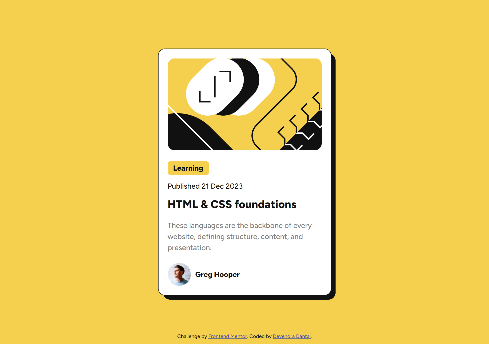

# Frontend Mentor - Blog preview card solution

## Overview

### The challenge

Users should be able to:

- See hover and focus states for all interactive elements on the page

### Screenshot

### Links

- Solution URL: [Add solution URL here](https://www.frontendmentor.io/solutions/frontend-preview-card-using-html-css-48gqI4g2A8)
- Live Site URL: [Add live site URL here](https://blog-card-preview12.netlify.app/)

## My process

### Built with

- Semantic HTML5 markup
- CSS custom properties
- Flexbox
- CSS Grid
- Mobile-first workflow